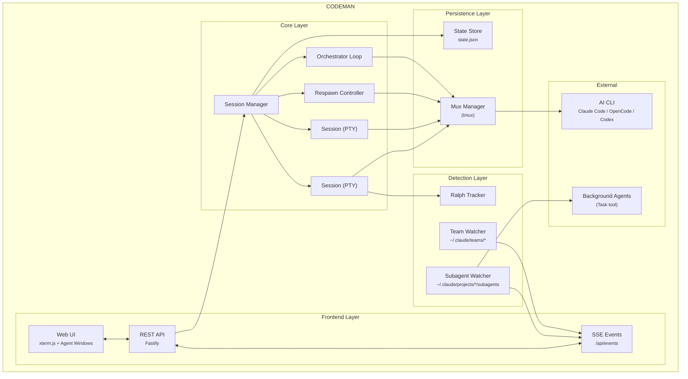

<p align="center">
  
</p>

<h2 align="center">Mission control for AI coding agents</h2>

<p align="center">
  <em>Claude Code &bull; OpenCode &bull; Codex &bull; Terminal - One Dashboard &bull; Any Device</em>
</p>

<p align="center">
  <a href="https://opensource.org/licenses/MIT"></a>
  <a href="https://nodejs.org/"></a>
  <a href="https://www.typescriptlang.org/"></a>
  <a href="https://fastify.dev/"></a>
  
</p>

<p align="center">
  <strong>English</strong> &bull; <a href="README.zh-CN.md">简体中文</a>
</p>

<p align="center">
  
</p>

---

## Quick Start - Installation

```bash
curl -fsSL https://raw.githubusercontent.com/Ark0N/Codeman/master/install.sh | bash
```

This installs Node.js and tmux if missing, clones Codeman to `~/.codeman/app`, and builds it.

You'll need at least one AI coding CLI installed — [Claude Code](https://docs.anthropic.com/en/docs/claude-code), [OpenCode](https://opencode.ai), or [Codex](https://developers.openai.com/codex/cli) (any combination works). After install:

```bash
codeman web
# Open http://localhost:3000 and start your first session
```

<details>
<summary><strong>Run as a background service</strong></summary>

**Linux (systemd):**
```bash
mkdir -p ~/.config/systemd/user
cat > ~/.config/systemd/user/codeman-web.service << EOF
[Unit]
Description=Codeman Web Server
After=network.target

[Service]
Type=simple
ExecStart=$(which node) $HOME/.codeman/app/dist/index.js web
Restart=always
RestartSec=10

[Install]
WantedBy=default.target
EOF
systemctl --user daemon-reload
systemctl --user enable --now codeman-web
loginctl enable-linger $USER
```

**macOS (launchd):**
```bash
mkdir -p ~/Library/LaunchAgents
cat > ~/Library/LaunchAgents/com.codeman.web.plist << EOF
<?xml version="1.0" encoding="UTF-8"?>
<!DOCTYPE plist PUBLIC "-//Apple//DTD PLIST 1.0//EN"
  "http://www.apple.com/DTDs/PropertyList-1.0.dtd">
<plist version="1.0">
<dict>
  <key>Label</key>
  <string>com.codeman.web</string>
  <key>ProgramArguments</key>
  <array>
    <string>$(which node)</string>
    <string>$HOME/.codeman/app/dist/index.js</string>
    <string>web</string>
  </array>
  <key>RunAtLoad</key><true/>
  <key>KeepAlive</key><true/>
  <key>StandardOutPath</key>
  <string>/tmp/codeman.log</string>
  <key>StandardErrorPath</key>
  <string>/tmp/codeman.log</string>
</dict>
</plist>
EOF
launchctl bootstrap gui/$(id -u) ~/Library/LaunchAgents/com.codeman.web.plist
```
</details>

<details>
<summary><strong>Windows (WSL)</strong></summary>

```powershell
wsl bash -c "curl -fsSL https://raw.githubusercontent.com/Ark0N/Codeman/master/install.sh | bash"
```

Codeman requires tmux, so Windows users need [WSL](https://learn.microsoft.com/en-us/windows/wsl/install). If you don't have WSL yet: run `wsl --install` in an admin PowerShell, reboot, open Ubuntu, then install your preferred AI coding CLI inside WSL ([Claude Code](https://docs.anthropic.com/en/docs/claude-code), [OpenCode](https://opencode.ai), or [Codex](https://developers.openai.com/codex/cli)). After installing, `http://localhost:3000` is accessible from your Windows browser.
</details>

---

## Mobile-Optimized Web UI

The most responsive AI coding agent experience on any phone. Full xterm.js terminal with local echo, swipe navigation, and a touch-optimized interface designed for real remote work — not a desktop UI crammed onto a small screen.

<table>
<tr>
<td align="center" width="33%"></td>
<td align="center" width="33%"></td>
<td align="center" width="33%"></td>
</tr>
<tr>
<td align="center"><em>Landing page with QR auth</em></td>
<td align="center"><em>Keyboard accessory bar</em></td>
<td align="center"><em>Agent working in real-time</em></td>
</tr>
</table>

<table>
<tr>
<th>Terminal Apps</th>
<th>Codeman Mobile</th>
</tr>
<tr><td>200-300ms input lag over remote</td><td><b>Local echo — instant feedback</b></td></tr>
<tr><td>Tiny text, no context</td><td>Full xterm.js terminal</td></tr>
<tr><td>No session management</td><td>Swipe between sessions</td></tr>
<tr><td>No notifications</td><td>Push alerts for approvals and idle</td></tr>
<tr><td>Manual reconnect</td><td>tmux persistence</td></tr>
<tr><td>No agent visibility</td><td>Background agents in real-time</td></tr>
<tr><td>Copy-paste slash commands</td><td>One-tap <code>/init</code>, <code>/clear</code>, <code>/compact</code></td></tr>
<tr><td>Password typing on phone</td><td><b>QR code scan — instant auth</b></td></tr>
</table>

### Secure QR Code Authentication

Typing passwords on a phone keyboard is miserable. Codeman replaces it with **cryptographically secure single-use QR tokens** — scan the code displayed on your desktop and your phone is authenticated instantly.

Each QR encodes a URL containing a 6-character short code that maps to a 256-bit secret (`crypto.randomBytes(32)`) on the server. Tokens auto-rotate every **60 seconds**, are **atomically consumed on first scan** (replays always fail), and use **hash-based `Map.get()` lookup** that leaks nothing through response timing. The short code is an opaque pointer — the real secret never appears in browser history, `Referer` headers, or Cloudflare edge logs.

The security design addresses all 6 critical QR auth flaws identified in ["Demystifying the (In)Security of QR Code-based Login"](https://www.usenix.org/conference/usenixsecurity25/presentation/zhang-xin) (USENIX Security 2025, which found 47 of the top-100 websites vulnerable): single-use enforcement, short TTL, cryptographic randomness, server-side generation, real-time desktop notification on scan (QRLjacking detection), and IP + User-Agent session binding with manual revocation. Dual-layer rate limiting (per-IP + global) makes brute force infeasible across 62^6 = 56.8 billion possible codes. Full security analysis: [`docs/qr-auth-plan.md`](docs/qr-auth-plan.md)

### Touch-Optimized Interface

- **Keyboard accessory bar** — `/init`, `/clear`, `/compact` quick-action buttons above the virtual keyboard. Destructive commands (`/clear`, `/compact`) require a double-press to confirm — first tap arms the button, second tap executes — so you never fire one by accident on a bumpy commute
- **Swipe navigation** — left/right on the terminal to switch sessions (80px threshold, 300ms)
- **Smart keyboard handling** — toolbar and terminal shift up when keyboard opens (uses `visualViewport` API with 100px threshold for iOS address bar drift)
- **Safe area support** — respects iPhone notch and home indicator via `env(safe-area-inset-*)`
- **44px touch targets** — all buttons meet iOS Human Interface Guidelines minimum sizes
- **Bottom sheet case picker** — slide-up modal replaces the desktop dropdown
- **Native momentum scrolling** — `-webkit-overflow-scrolling: touch` for buttery scroll

```bash
codeman web --https
# Open on your phone: https://<your-ip>:3000
```

> `localhost` works over plain HTTP. Use `--https` when accessing from another device, or use [Tailscale](https://tailscale.com/) (recommended) — it provides a private network so you can access `http://<tailscale-ip>:3000` from your phone without TLS certificates.

---

## Live Agent Visualization

Watch background agents work in real-time. Codeman monitors agent activity and displays each agent in a draggable floating window with animated Matrix-style connection lines back to the parent session.

<p align="center">
  
</p>

- **Floating terminal windows** — draggable, resizable panels for each agent with a live activity log showing every tool call, file read, and progress update as it happens
- **Connection lines** — animated green lines linking parent sessions to their child agents, updating in real-time as agents spawn and complete
- **Status & model badges** — green (active), yellow (idle), blue (completed) indicators with Haiku/Sonnet/Opus model color coding
- **Auto-behavior** — windows auto-open on spawn, auto-minimize on completion, tab badge shows "AGENT" or "AGENTS (n)" count
- **Nested agents** — supports 3-level hierarchies (lead session -> teammate agents -> sub-subagents)

**Agent Teams** — first-class support for Claude Code's native multi-agent teams (`CLAUDE_CODE_EXPERIMENTAL_AGENT_TEAMS=1`). `TeamWatcher` polls `~/.claude/teams/`, matches teammates to their lead session, and surfaces them as live subagent windows with **team-aware idle detection** — so the Respawn Controller won't fire while teammates are still working. See [`docs/agent-teams/`](docs/agent-teams/).

---

## Zero-Lag Input Overlay

<p align="center">
  
</p>

When accessing your coding agent remotely (VPN, Tailscale, SSH tunnel), every keystroke normally takes 200-300ms to round-trip. Codeman implements a **Mosh-inspired local echo system** that makes typing feel instant regardless of latency.

A pixel-perfect DOM overlay inside xterm.js renders keystrokes at 0ms. Background forwarding silently sends every character to the PTY in 50ms debounced batches, so Tab completion, `Ctrl+R` history search, and all shell features work normally. When the server echo arrives 200-300ms later, the overlay seamlessly disappears and the real terminal text takes over — the transition is invisible.

- **Ink-proof architecture** — lives as a `<span>` at z-index 7 inside `.xterm-screen`, completely immune to Ink's constant screen redraws (two previous attempts using `terminal.write()` failed because Ink corrupts injected buffer content)
- **Font-matched rendering** — reads `fontFamily`, `fontSize`, `fontWeight`, and `letterSpacing` from xterm.js computed styles so overlay text is visually indistinguishable from real terminal output
- **Full editing** — backspace, retype, paste (multi-char), cursor tracking, multi-line wrap when input exceeds terminal width
- **Persistent across reconnects** — unsent input survives page reloads via localStorage
- **Enabled by default** — works on both desktop and mobile, during idle and busy sessions

> Extracted as a standalone library: [`xterm-zerolag-input`](https://www.npmjs.com/package/xterm-zerolag-input) — see [Published Packages](#published-packages).

---

## Respawn Controller

The core of autonomous work. When the agent goes idle, the Respawn Controller detects it, sends a continue prompt, cycles context management commands for fresh context, and resumes — running **24+ hours** completely unattended.

```
WATCHING → IDLE DETECTED → SEND UPDATE → /clear → /init → CONTINUE → WATCHING
```

- **Multi-layer idle detection** — completion messages, AI-powered idle check, output silence, token stability
- **Auto-resume on usage limit** *(opt-in, off by default)* — when Claude halts on a subscription limit ("You've hit your limit · resets 3pm"), Codeman parses the reset time, waits it out plus a 2-minute safety buffer, then dismisses the rate-limit dialog and sends `continue` — so an overnight run survives the 5-hour window instead of stalling until morning. Recognizes every Claude Code limit-message format, retries if still limited, survives Codeman restarts, and holds respawn cycles while paused so `/clear` can't wipe the waiting conversation. Enable per session at the top of the Respawn tab
- **Circuit breaker** — prevents respawn thrashing when Claude is stuck (CLOSED -> HALF_OPEN -> OPEN states, tracks consecutive no-progress and repeated errors)
- **Health scoring** — 0-100 health score with component scores for cycle success, circuit breaker state, iteration progress, and stuck recovery
- **Built-in presets** — `solo-work` (3s idle, 60min), `subagent-workflow` (45s, 240min), `team-lead` (90s, 480min), `ralph-todo` (8s, 480min), `overnight-autonomous` (10s, 480min)

---

## Orchestrator Loop

Beyond single-session respawn, the **Orchestrator** turns a high-level goal into a phased plan and drives it to completion across multiple agents — a state machine that runs `idle → planning → approval → executing → verifying → (replanning) → completed`.

- **Plan, then execute** — generates a phased plan from your goal and pauses for approval before touching anything; reject with feedback to regenerate
- **Per-phase verification gates** — each phase is verified before the next begins; on failure the orchestrator replans instead of barreling ahead
- **Multi-agent execution** — fans phases out to team agents / a task queue, coordinating work too big for one session
- **Crash-safe** — full state persists under the `orchestrator` key in `state.json`, so it survives restarts
- **Driven from the UI or API** — the Orchestrator panel, or `POST /api/orchestrator/start` → `/approve` → `/status` (10 endpoints)

> Distinct from Ralph (a single-session autonomous loop): the orchestrator coordinates multi-phase, multi-agent execution. Full design: [`docs/orchestrator-loop-architecture.md`](docs/orchestrator-loop-architecture.md).

---

## Multi-Session Dashboard

Run **20 parallel sessions** with full visibility — real-time xterm.js terminals at 60fps, per-session token and cost tracking, tab-based navigation, and one-click management.

<p align="center">
  
</p>

### Persistent Sessions

Every session runs inside **tmux** — sessions survive server restarts, network drops, and machine sleep. Auto-recovery on startup with dual redundancy. Ghost session discovery finds orphaned tmux sessions. Managed sessions are environment-tagged so the agent won't kill its own session.

### Hostname-Aware Window Title

Running Codeman on multiple hosts (laptop, dev box, NAS)? The browser tab title is `codeman:<hostname>` so you can tell which backend each tab points at without clicking in:

```bash
codeman web                                # codeman:<os.hostname()>
codeman web --title-hostname dev-box       # codeman:dev-box (manual override for noisy hostnames)
```

The title is templated into the served HTML on first byte, so it's correct from the very first paint and works without JavaScript. The same hostname prefix is applied to the tab-flash format (`⚠️ (N) codeman:<host>`) and to OS-level desktop notifications (`codeman:<host>: <event>`), so cross-host alerts in the system notification center are also unambiguous.

### Smart Token Management

| Threshold | Action | Result |
|-----------|--------|--------|
| **110k tokens** | Auto `/compact` | Context summarized, work continues |
| **140k tokens** | Auto `/clear` | Fresh start with `/init` |

### Notifications

Real-time desktop alerts when sessions need attention — `permission_prompt` and `elicitation_dialog` trigger critical red tab blinks, `idle_prompt` triggers yellow blinks. Click any notification to jump directly to the affected session. Hooks auto-configured per case directory.

### Ralph / Todo Tracking

Auto-detects Ralph Loops, `<promise>` tags, TodoWrite progress (`4/9 complete`), and iteration counters (`[5/50]`) with real-time progress rings and elapsed time tracking.

<p align="center">
  
</p>

### Run Summary

Click the chart icon on any session tab to see a timeline of everything that happened — respawn cycles, token milestones, auto-compact triggers, idle/working transitions, hook events, errors, and more.

### Zero-Flicker Terminal

Terminal-based AI agents (Claude Code's Ink, OpenCode's Bubble Tea) redraw the screen on every state change. Codeman implements a 6-layer anti-flicker pipeline for smooth 60fps output across all sessions:

```
PTY Output → 16ms Server Batch → DEC 2026 Wrap → SSE → Client rAF → xterm.js (60fps)
```

---

## More Features

- **Self-update** — git-clone installs under systemd/launchd update in place from **App Settings → Updates**: it detects the latest release, auto-stashes a dirty tree, and streams build progress across the service restart (npm installs report as non-updatable)
- **Multi-CLI** — run **Claude Code**, **OpenCode**, or **Codex** per session; env-var prefixes auto-gate (`CLAUDE_CODE_*` vs `OPENCODE_*` vs `CODEX_*`). See [`docs/opencode-integration.md`](docs/opencode-integration.md)
- **Effort & Ultracode** — set a per-session default effort (`low`–`max`) or enable **ultracode** (dynamic multi-agent workflows). Soft defaults only — switchable anytime with `/effort` in-session. Extended-thinking budget is configurable too
- **Voice input** — dictate prompts with Deepgram Nova-3 (Web Speech API fallback): toggle recording, auto-silence stop, live level meter (`Ctrl+Shift+V`)
- **Image input** — paste or drag-and-drop images straight into a session
- **Gesture control** *(opt-in)* — a MediaPipe hand-tracking overlay to grab/drag session windows and pinch buttons, hands-free. Enable with `CODEMAN_GESTURE=1` + App Settings → Display
- **Multi-monitor span** *(macOS)* — one click opens a browser window maximized across all displays, so floating agent/gesture panels can cross the physical seam
- **CJK / IME input** — full composition support for Chinese / Japanese / Korean
- **OS notifications & hostname-aware titles** — desktop alerts and tab titles are prefixed `codeman:<host>` so multi-host setups stay unambiguous

---

## Remote Access — Cloudflare Tunnel

Access Codeman from your phone or any device outside your local network using a free [Cloudflare quick tunnel](https://developers.cloudflare.com/cloudflare-one/connections/connect-networks/do-more-with-tunnels/trycloudflare/) — no port forwarding, no DNS, no static IP required.

```
Browser (phone/tablet) → Cloudflare Edge (HTTPS) → cloudflared → localhost:3000
```

**Prerequisites:** Install [`cloudflared`](https://developers.cloudflare.com/cloudflare-one/connections/connect-networks/downloads/) and set `CODEMAN_PASSWORD` in your environment.

```bash
# Quick start
./scripts/tunnel.sh start      # Start tunnel, prints public URL
./scripts/tunnel.sh url        # Show current URL
./scripts/tunnel.sh stop       # Stop tunnel
./scripts/tunnel.sh status     # Service status + URL
```

The script auto-installs a systemd user service on first run. The tunnel URL is a randomly generated `*.trycloudflare.com` address that changes each time the tunnel restarts.

<details>
<summary><strong>Persistent tunnel (survives reboots)</strong></summary>

```bash
# Enable as a persistent service
systemctl --user enable codeman-tunnel
loginctl enable-linger $USER

# Or via the Codeman web UI: Settings → Tunnel → Toggle On
```

</details>

<details>
<summary><strong>Authentication</strong></summary>

1. First request → browser shows Basic Auth prompt (username: `admin` or `CODEMAN_USERNAME`)
2. On success → server issues a `codeman_session` cookie (24h TTL, auto-extends on activity)
3. Subsequent requests authenticate silently via cookie
4. 10 failed attempts per IP → 429 rate limit (15-minute decay)

**Always set `CODEMAN_PASSWORD`** before exposing via tunnel — without it, anyone with the URL has full access to your sessions.

</details>

### QR Code Authentication

Typing a password on a phone keyboard is terrible. Codeman solves this with **ephemeral single-use QR tokens** — scan the code on your desktop, and your phone is instantly authenticated. No password prompt, no typing, no clipboard.

```
Desktop displays QR  →  Phone scans  →  GET /q/Xk9mQ3  →  Server validates
→  Token atomically consumed (single-use)  →  Session cookie issued  →  302 to /
→  Desktop notified: "Device authenticated via QR"  →  New QR auto-generated
```

Someone who only has the bare tunnel URL (without the QR) still hits the standard password prompt. The QR is the fast path; the password is the fallback.

#### How It Works

The server maintains a rotating pool of short-lived, single-use tokens. Each token consists of a 256-bit secret (`crypto.randomBytes(32)`) paired with a 6-character base62 short code used as an opaque lookup key in the URL path. The QR code encodes a URL like `https://abc-xyz.trycloudflare.com/q/Xk9mQ3` — the short code is a pointer, not the secret itself, so it never leaks through browser history, `Referer` headers, or Cloudflare edge logs.

Every **60 seconds**, the server automatically rotates to a fresh token. The previous token remains valid for a **90-second grace period** to handle the race where you scan right as rotation happens — after that, it's dead. Each token is **single-use**: the moment a phone successfully scans it, the token is atomically consumed and a new one is immediately generated for the desktop display.

#### Security Design

The design is informed by ["Demystifying the (In)Security of QR Code-based Login"](https://www.usenix.org/conference/usenixsecurity25/presentation/zhang-xin) (USENIX Security 2025), which found 47 of the top-100 websites vulnerable to QR auth attacks due to 6 critical design flaws across 42 CVEs. Codeman addresses all six:

| USENIX Flaw | Mitigation |
|-------------|------------|
| **Flaw-1**: Missing single-use enforcement | Token atomically consumed on first scan — replays always fail |
| **Flaw-2**: Long-lived tokens | 60s TTL with 90s grace, auto-rotation via timer |
| **Flaw-3**: Predictable token generation | `crypto.randomBytes(32)` — 256-bit entropy. Short codes use rejection sampling to eliminate modulo bias |
| **Flaw-4**: Client-side token generation | Server-side only — tokens never leave the server until embedded in the QR |
| **Flaw-5**: Missing status notification | Desktop toast: *"Device [IP] authenticated via QR (Safari). Not you? [Revoke]"* — real-time QRLjacking detection |
| **Flaw-6**: Inadequate session binding | IP + User-Agent stored for audit. Manual session revocation via API. HttpOnly + Secure + SameSite=lax cookies |

#### Timing-Safe Lookup

Short codes are stored in a `Map<shortCode, TokenRecord>`. Validation uses `Map.get()` — a hash-based O(1) lookup that reveals nothing about the target string through response timing. There is no character-by-character string comparison anywhere in the hot path, eliminating timing side-channel attacks entirely.

#### Rate Limiting (Dual Layer)

QR auth has its own rate limiting, completely independent from password auth:

- **Per-IP**: 10 failed QR attempts per IP trigger a 429 block (15-minute decay window) — separate counter from Basic Auth failures, so a fat-fingered password doesn't burn your QR budget
- **Global**: 30 QR attempts per minute across all IPs combined — defends against distributed brute force. With 62^6 = 56.8 billion possible short codes and only ~2 valid at any time, brute force is computationally infeasible regardless

#### QR Code Size Optimization

The URL is kept deliberately short (`/q/` path + 6-char code = ~53-56 total characters) to target **QR Version 4** (33x33 modules) instead of Version 5 (37x37). Smaller QR codes scan faster on budget phones — modern devices read Version 4 in 100-300ms. The `/q/` prefix saves 7 bytes compared to `/qr-auth/`, which alone is the difference between QR versions.

#### Desktop Experience

The QR display auto-refreshes every 60 seconds via SSE with the SVG embedded directly in the event payload (~2-5KB) — no extra HTTP fetch, sub-50ms refresh. A countdown timer shows time remaining. A "Regenerate" button instantly invalidates all existing tokens and creates a fresh one (useful if you suspect the QR was photographed).

When someone authenticates via QR, the desktop shows a notification toast with the device's IP and browser — if it wasn't you, one click revokes all sessions.

#### Threat Coverage

| Threat | Why it doesn't work |
|--------|-------------------|
| **QR screenshot shared** | Single-use: consumed on first scan. 60s TTL: expired before the attacker can act. Desktop notification alerts you immediately. |
| **Replay attack** | Atomic single-use consumption + 60s TTL. Old URLs always return 401. |
| **Cloudflare edge logs** | Short code is an opaque 6-char lookup key, not the real 256-bit token. Single-use means replaying from logs always fails. |
| **Brute force** | 56.8 billion combinations, ~2 valid at any time, dual-layer rate limiting blocks well before statistical feasibility. |
| **QRLjacking** | 60s rotation forces real-time relay. Desktop toast provides instant detection. Self-hosted single-user context makes phishing implausible. |
| **Timing attack** | Hash-based Map lookup — no string comparison timing leak. |
| **Session cookie theft** | HttpOnly + Secure + SameSite=lax + 24h TTL. Manual revocation at `POST /api/auth/revoke`. |

#### How It Compares

| Platform | Model | Comparison |
|----------|-------|------------|
| **Discord** | Long-lived token, no confirmation, [repeatedly exploited](https://owasp.org/www-community/attacks/Qrljacking) | Codeman: single-use + TTL + notification |
| **WhatsApp Web** | Phone confirms "Link device?", ~60s rotation | Comparable rotation; WhatsApp adds explicit confirmation (acceptable tradeoff for single-user) |
| **Signal** | Ephemeral public key, E2E encrypted channel | Stronger crypto, but [exploited by Russian state actors in 2025](https://cloud.google.com/blog/topics/threat-intelligence/russia-targeting-signal-messenger) via social engineering despite it |

> Full design rationale, security analysis, and implementation details: [`docs/qr-auth-plan.md`](docs/qr-auth-plan.md)

---

## Security

Codeman launches sessions with `--dangerously-skip-permissions`, so the web UI is by design a remote-code-execution surface for whoever can reach it — the whole security model exists to control *who* that is. Recent hardening (v0.9.0 + v0.9.5) closes the browser-driven attack paths that bite self-hosted dev tools. Full model: [`docs/security-architecture.md`](docs/security-architecture.md). **Found a vulnerability?** See [`SECURITY.md`](SECURITY.md) for private disclosure and the list of known limitations.

### Network & access

- **Loopback by default** — binds `127.0.0.1`, reachable only from the same machine, so the no-password default is safe out of the box. Binding a non-loopback host without `CODEMAN_PASSWORD` *starts but prints a loud warning* with three concrete fixes (set a password, loopback + an authenticated tunnel, or explicitly acknowledge with `--allow-unauthenticated-network`)
- **Optional auth, real sessions** — HTTP Basic via `CODEMAN_USERNAME` (default `admin`) / `CODEMAN_PASSWORD`. Success issues an opaque 256-bit `codeman_session` cookie (`randomBytes(32)`) — validated server-side, not client-signed, so it can't be forged offline (24h TTL, auto-extend, device-context audit log)
- **Per-IP rate limiting** — 10 failed attempts → `429` with `Retry-After` (15-min decay). A valid cookie or correct password recovers *immediately* even while an attacker hammers the same IP — important because all tunnel traffic shares one loopback IP. QR auth has its own separate limiter

### Always-on browser hardening (v0.9.5)

These run for **every** request — before auth, even on the default no-password loopback install:

- **Host-header allowlist → blocks DNS rebinding.** A custom domain rebound to `127.0.0.1` is rejected with `403 host not allowed` before any handler runs. Allowed: `localhost`, any IP literal, the bind host, `.ts.net` / `.trycloudflare.com` / `.cfargotunnel.com`, the active managed tunnel, and `CODEMAN_ALLOWED_HOSTS` (add custom reverse-proxy domains here — comma-separated; exact host or leading-dot `.suffix` for subdomains)
- **Cross-site Origin / CSRF guard.** On state-changing methods (`POST`/`PUT`/`PATCH`/`DELETE`) the `Origin` must pass the same allowlist, else `403 cross-site request blocked`. A *missing* Origin is allowed (so `curl`, the CLI, and Claude Code hooks keep working); only a present-but-foreign or opaque `null` origin is rejected
- **Raw `text/plain` bodies.** The global parser no longer JSON-parses `text/plain`, closing the CORS "simple request" CSRF vector where a cross-site `fetch` could smuggle JSON into a write route with no preflight
- **WebSocket origin validation.** The terminal WS upgrade runs the same Host + Origin check and closes with code `4003` on failure (anti-CSWSH)
- **XSS-escaped agent output.** AI-derived strings (tool names, command arguments, subagent descriptions) are HTML-escaped at every injection site before rendering in the subagent / activity panels

### Input, files & headers

- **Schema-validated inputs** — every API body is checked with Zod v4 schemas; a `CLAUDE_CODE_*` / `OPENCODE_*` / `CODEX_*` env-prefix allowlist gates which settings each CLI can receive
- **Path containment** — file routes `realpath` before boundary checks (no TOCTOU); `..`, absolute paths, and symlinks resolving outside the working dir are rejected. Caps: 10 MB text preview / 50 MB raw & download; `/api/download` blocklists sensitive paths (`.env`, `*credentials*`, `~/.ssh/`, `.aws/credentials`). SVG/HTML is served `octet-stream` + `nosniff` + attachment so it downloads rather than executes
- **Security headers** — `Content-Security-Policy` (`default-src 'self'`, every exception enumerated), `X-Content-Type-Options: nosniff`, `X-Frame-Options: SAMEORIGIN`, HSTS over HTTPS, and CORS reflected **only** for `localhost` / `127.0.0.1` / `::1`

### Supply chain & isolation

- **Pinned & verified deps** — security-sensitive transitive deps are forced to patched versions via npm `overrides`; lockfile integrity is checked on every commit/PR (all entries resolve to `registry.npmjs.org` with `sha512` hashes). Public assets are NUL-byte-scanned and `node --check`-validated in CI
- **Multi-instance isolation** — `CODEMAN_INSTANCE` scopes both the tmux socket (`-L codeman-<name>`) and data dir (`~/.codeman-<name>`) so two instances never attach each other's live sessions

> Mobile login uses single-use, 60-second QR tokens — see [QR Code Authentication](#qr-code-authentication) above for the full design (it addresses all 6 flaws from USENIX Security 2025's QR-login study).

---

## SSH Alternative (`sc`)

If you prefer SSH (Termius, Blink, etc.), the `sc` command is a thumb-friendly session chooser:

```bash
sc              # Interactive chooser
sc 2            # Quick attach to session 2
sc -l           # List sessions
```

Single-digit selection (1-9), color-coded status, token counts, auto-refresh. Detach with `Ctrl+A D`.

---

## Keyboard Shortcuts

> Ctrl bindings also accept Cmd on macOS.

| Shortcut | Action |
|----------|--------|
| `Ctrl/Cmd+W` | Kill active session |
| `Ctrl/Cmd+Tab` | Next session |
| `Option+[` / `Option+]` | Previous / next session |
| `Option+1`-`Option+9` | Switch to tab N (physical keys, so macOS Option layouts work) |
| `Ctrl+Shift+{` / `Ctrl+Shift+}` | Move active tab left / right |
| `Ctrl/Cmd+L` | Clear terminal |
| `Ctrl+Shift+R` | Restore terminal size |
| `Ctrl+Shift+V` | Toggle voice input |
| `Ctrl/Cmd +` / `-` | Font size |
| `Ctrl/Cmd+?` | Keyboard help |
| `Shift+Enter` | Insert newline (sent to terminal) |
| `Escape` | Close panels & modals |

---

## API

REST over Fastify — **~140 handlers across 15 route modules**, plus an SSE stream and a WebSocket terminal channel. A representative subset:

### Sessions
| Method | Endpoint | Description |
|--------|----------|-------------|
| `GET` | `/api/sessions` | List all |
| `POST` | `/api/quick-start` | Create case + start session |
| `DELETE` | `/api/sessions/:id` | Delete session |
| `POST` | `/api/sessions/:id/input` | Send input |

### Respawn
| Method | Endpoint | Description |
|--------|----------|-------------|
| `POST` | `/api/sessions/:id/respawn/enable` | Enable with config + timer |
| `POST` | `/api/sessions/:id/respawn/stop` | Stop controller |
| `PUT` | `/api/sessions/:id/respawn/config` | Update config |

### Ralph / Todo
| Method | Endpoint | Description |
|--------|----------|-------------|
| `GET` | `/api/sessions/:id/ralph-state` | Get loop state + todos |
| `POST` | `/api/sessions/:id/ralph-config` | Configure tracking |

### Orchestrator
| Method | Endpoint | Description |
|--------|----------|-------------|
| `POST` | `/api/orchestrator/start` | Start orchestration from a goal |
| `POST` | `/api/orchestrator/approve` | Approve the generated plan |
| `GET` | `/api/orchestrator/status` | Current phase + progress |
| `POST` | `/api/orchestrator/stop` | Stop and clean up |

### Subagents
| Method | Endpoint | Description |
|--------|----------|-------------|
| `GET` | `/api/subagents` | List all background agents |
| `GET` | `/api/subagents/:id` | Agent info and status |
| `GET` | `/api/subagents/:id/transcript` | Full activity transcript |
| `DELETE` | `/api/subagents/:id` | Kill agent process |

### System
| Method | Endpoint | Description |
|--------|----------|-------------|
| `GET` | `/api/events` | SSE stream |
| `GET` | `/api/status` | Full app state |
| `POST` | `/api/hook-event` | Hook callbacks |
| `GET` | `/api/system/update/check` | Check for a new release |
| `POST` | `/api/system/update` | Self-update (git-clone installs) |
| `POST` | `/api/clipboard` | Push text to all connected browsers (`{text}`) |
| `GET` | `/api/sessions/:id/run-summary` | Timeline + stats |

---

## Architecture



---

## Development

```bash
npm install
npx tsx src/index.ts web    # Dev mode
npm run build               # Production build
npm test                    # Run tests
```

See [CLAUDE.md](./CLAUDE.md) for full documentation.

---

## Codebase Quality

The codebase went through a comprehensive 7-phase refactoring that eliminated god objects, centralized configuration, and established modular architecture:

| Phase | What changed | Impact |
|-------|-------------|--------|
| **Performance** | Cached endpoints, SSE adaptive batching, buffer chunking | Sub-16ms terminal latency |
| **Route extraction** | `server.ts` split into 15 domain route modules + auth middleware + port interfaces | **−67%** server.ts LOC (6,736 → 2,254) |
| **Domain splitting** | `types.ts` → 16 domain files, `ralph-tracker` → 7 files, `respawn-controller` → 5 files, `session` → 6 files | No more god files |
| **Frontend modules** | `app.js` → 18 extracted modules across infra, domain & feature layers | app.js core down to **~3.4K LOC** |
| **Config consolidation** | ~70 scattered magic numbers → 10 domain-focused config files | Zero cross-file duplicates |
| **Test infrastructure** | Shared mock library, 12 route test files, consolidated MockSession | Testable route handlers via `app.inject()` |

Full details: [`docs/archive/code-structure-findings.md`](docs/archive/code-structure-findings.md)

---

## Published Packages

### [`xterm-zerolag-input`](https://www.npmjs.com/package/xterm-zerolag-input)

[](https://www.npmjs.com/package/xterm-zerolag-input)

Instant keystroke feedback overlay for xterm.js. Eliminates perceived input latency over high-RTT connections by rendering typed characters immediately as a pixel-perfect DOM overlay. Zero dependencies, configurable prompt detection, full state machine with 78 tests.

```bash
npm install xterm-zerolag-input
```

[Full documentation](packages/xterm-zerolag-input/README.md)

---

## Versioning

Codeman follows [SemVer](https://semver.org/). What the version number actually
commits to — and what counts as internal (the HTTP/SSE API, on-disk state,
experimental features) — is spelled out in
[`docs/versioning-policy.md`](docs/versioning-policy.md). If you script against
the HTTP API, pin to an exact version.

## License

MIT — see [LICENSE](LICENSE)

---

<p align="center">
  <strong>Track sessions. Visualize agents. Control respawn. Let it run while you sleep.</strong>
</p>
