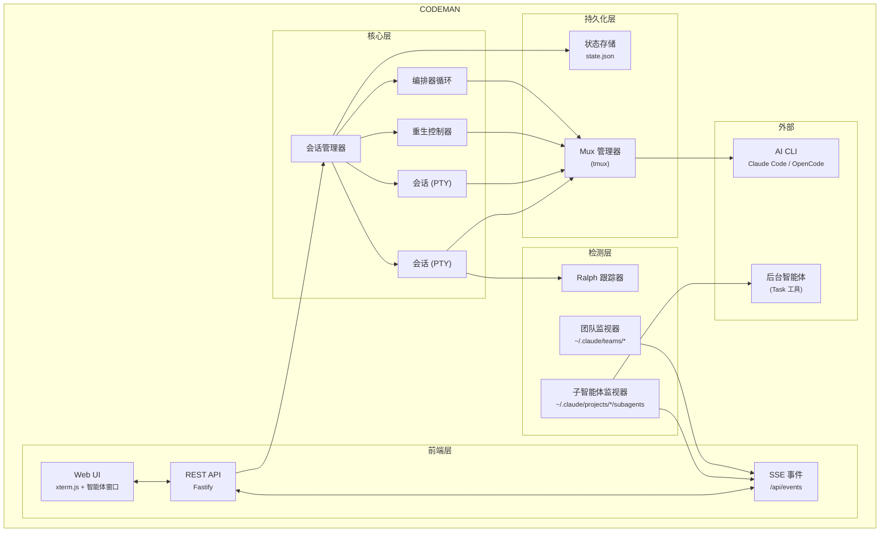

<p align="center">
  
</p>

<h2 align="center">为 AI 编程智能体而生的「控制平面」</h2>

<p align="center">
  <em>智能体可视化 &bull; 零延迟输入 &bull; 自主编排器 &bull; 重生控制器 &bull; 移动优先 UI &bull; 安全加固</em>
</p>

<p align="center">
  <a href="README.md">English</a> &bull; <strong>简体中文</strong>
</p>

<p align="center">
  <a href="https://opensource.org/licenses/MIT"></a>
  <a href="https://nodejs.org/"></a>
  <a href="https://www.typescriptlang.org/"></a>
  <a href="https://fastify.dev/"></a>
  
</p>

<p align="center">
  
</p>

> 本文档由英文版 [`README.md`](README.md) 翻译而来。如有出入，以英文版为准。

---

## 快速开始 — 安装

```bash
curl -fsSL https://raw.githubusercontent.com/Ark0N/Codeman/master/install.sh | bash
```

该脚本会在缺失时自动安装 Node.js 和 tmux，把 Codeman 克隆到 `~/.codeman/app` 并完成构建。

你至少需要安装一个 AI 编程 CLI —— [Claude Code](https://docs.anthropic.com/en/docs/claude-code) 或 [OpenCode](https://opencode.ai)（两个都装也可以）。安装完成后：

```bash
codeman web
# 打开 http://localhost:3000，开启你的第一个会话
```

<details>
<summary><strong>作为后台服务运行</strong></summary>

**Linux（systemd）：**
```bash
mkdir -p ~/.config/systemd/user
cat > ~/.config/systemd/user/codeman-web.service << EOF
[Unit]
Description=Codeman Web Server
After=network.target

[Service]
Type=simple
ExecStart=$(which node) $HOME/.codeman/app/dist/index.js web
Restart=always
RestartSec=10

[Install]
WantedBy=default.target
EOF
systemctl --user daemon-reload
systemctl --user enable --now codeman-web
loginctl enable-linger $USER
```

**macOS（launchd）：**
```bash
mkdir -p ~/Library/LaunchAgents
cat > ~/Library/LaunchAgents/com.codeman.web.plist << EOF
<?xml version="1.0" encoding="UTF-8"?>
<!DOCTYPE plist PUBLIC "-//Apple//DTD PLIST 1.0//EN"
  "http://www.apple.com/DTDs/PropertyList-1.0.dtd">
<plist version="1.0">
<dict>
  <key>Label</key>
  <string>com.codeman.web</string>
  <key>ProgramArguments</key>
  <array>
    <string>$(which node)</string>
    <string>$HOME/.codeman/app/dist/index.js</string>
    <string>web</string>
  </array>
  <key>RunAtLoad</key><true/>
  <key>KeepAlive</key><true/>
  <key>StandardOutPath</key>
  <string>/tmp/codeman.log</string>
  <key>StandardErrorPath</key>
  <string>/tmp/codeman.log</string>
</dict>
</plist>
EOF
launchctl bootstrap gui/$(id -u) ~/Library/LaunchAgents/com.codeman.web.plist
```
</details>

<details>
<summary><strong>Windows（WSL）</strong></summary>

```powershell
wsl bash -c "curl -fsSL https://raw.githubusercontent.com/Ark0N/Codeman/master/install.sh | bash"
```

Codeman 依赖 tmux，因此 Windows 用户需要 [WSL](https://learn.microsoft.com/en-us/windows/wsl/install)。如果还没装 WSL：在管理员 PowerShell 中运行 `wsl --install`，重启，打开 Ubuntu，然后在 WSL 内安装你偏好的 AI 编程 CLI（[Claude Code](https://docs.anthropic.com/en/docs/claude-code) 或 [OpenCode](https://opencode.ai)）。安装完成后，即可从 Windows 浏览器访问 `http://localhost:3000`。
</details>

---

## 移动端优化的 Web UI

在任意手机上都能获得最跟手的 AI 编程智能体体验。完整的 xterm.js 终端、本地回显、滑动导航，以及为真正的远程办公而设计的触控优化界面 —— 而不是把桌面 UI 硬塞进小屏幕。

<table>
<tr>
<td align="center" width="33%"></td>
<td align="center" width="33%"></td>
<td align="center" width="33%"></td>
</tr>
<tr>
<td align="center"><em>带二维码认证的登录页</em></td>
<td align="center"><em>键盘配件栏</em></td>
<td align="center"><em>智能体实时工作中</em></td>
</tr>
</table>

<table>
<tr>
<th>普通终端 App</th>
<th>Codeman 移动端</th>
</tr>
<tr><td>远程输入延迟 200–300 毫秒</td><td><b>本地回显 —— 即时反馈</b></td></tr>
<tr><td>字小、无上下文</td><td>完整 xterm.js 终端</td></tr>
<tr><td>无会话管理</td><td>滑动切换会话</td></tr>
<tr><td>无通知</td><td>审批 / 空闲时推送提醒</td></tr>
<tr><td>需手动重连</td><td>tmux 持久化</td></tr>
<tr><td>看不到智能体</td><td>实时查看后台智能体</td></tr>
<tr><td>斜杠命令靠复制粘贴</td><td>一键 <code>/init</code>、<code>/clear</code>、<code>/compact</code></td></tr>
<tr><td>在手机上手打密码</td><td><b>扫二维码 —— 即时认证</b></td></tr>
</table>

### 安全的二维码认证

在手机键盘上输密码太痛苦了。Codeman 用**密码学安全的一次性二维码令牌**取而代之 —— 扫描桌面上显示的二维码，手机即刻完成认证。

每个二维码编码的是一个包含 6 字符短码的 URL，该短码在服务端映射到一个 256 位密钥（`crypto.randomBytes(32)`）。令牌每 **60 秒**自动轮换，**首次扫描即原子性消费**（重放永远失败），并采用**基于哈希的 `Map.get()` 查找**，不会通过响应时延泄露任何信息。短码只是一个不透明指针 —— 真正的密钥永远不会出现在浏览器历史、`Referer` 头或 Cloudflare 边缘日志中。

该安全设计覆盖了 ["Demystifying the (In)Security of QR Code-based Login"](https://www.usenix.org/conference/usenixsecurity25/presentation/zhang-xin)（USENIX Security 2025，该研究发现 Top-100 网站中有 47 个存在漏洞）所指出的全部 6 个关键二维码认证缺陷：强制一次性使用、短 TTL、密码学随机性、服务端生成、扫描时桌面实时通知（QRLjacking 检测），以及 IP + User-Agent 会话绑定与手动吊销。双层速率限制（按 IP + 全局）使得在 62^6 = 568 亿种可能短码空间内进行暴力破解变得不可行。完整安全分析见：[`docs/qr-auth-plan.md`](docs/qr-auth-plan.md)

### 触控优化界面

- **键盘配件栏** —— 在虚拟键盘上方提供 `/init`、`/clear`、`/compact` 快捷按钮。破坏性命令（`/clear`、`/compact`）需双击确认 —— 第一次点击「上膛」，第二次点击执行 —— 这样在颠簸的通勤路上也不会误触
- **滑动导航** —— 在终端上左右滑动切换会话（阈值 80px，300ms）
- **智能键盘处理** —— 键盘弹出时工具栏与终端整体上移（使用 `visualViewport` API，并对 iOS 地址栏漂移设置 100px 阈值）
- **安全区适配** —— 通过 `env(safe-area-inset-*)` 适配 iPhone 刘海与底部 Home 指示条
- **44px 触控目标** —— 所有按钮均满足 iOS 人机界面指南的最小尺寸
- **底部抽屉式 case 选择器** —— 用上滑模态框替代桌面端下拉菜单
- **原生惯性滚动** —— `-webkit-overflow-scrolling: touch`，丝滑流畅

```bash
codeman web --https
# 在手机上打开：https://<你的IP>:3000
```

> `localhost` 走纯 HTTP 即可。从其他设备访问时请使用 `--https`，或使用 [Tailscale](https://tailscale.com/)（推荐）—— 它提供私有网络，让你无需 TLS 证书即可从手机访问 `http://<tailscale-ip>:3000`。

---

## 实时智能体可视化

实时观看后台智能体工作。Codeman 监控智能体活动，将每个智能体显示在一个可拖拽的浮动窗口中，并用「黑客帝国」风格的动态连接线连回父会话。

<p align="center">
  
</p>

- **浮动终端窗口** —— 每个智能体一个可拖拽、可调整大小的面板，带实时活动日志，逐条展示每一次工具调用、文件读取与进度更新
- **连接线** —— 用动态绿色线条连接父会话与其子智能体，随智能体的产生与完成实时更新
- **状态与模型徽标** —— 绿色（活动）、黄色（空闲）、蓝色（已完成）指示，并以 Haiku/Sonnet/Opus 的颜色编码区分模型
- **自动行为** —— 窗口在产生时自动打开、完成时自动最小化，标签徽标显示「AGENT」或「AGENTS (n)」计数
- **嵌套智能体** —— 支持 3 层层级（主会话 → 团队成员智能体 → 子-子智能体）

**智能体团队（Agent Teams）** —— 一等公民式支持 Claude Code 原生的多智能体团队（`CLAUDE_CODE_EXPERIMENTAL_AGENT_TEAMS=1`）。`TeamWatcher` 轮询 `~/.claude/teams/`，将团队成员匹配到其主会话，并以实时子智能体窗口呈现，且具备**团队感知的空闲检测** —— 因此当团队成员仍在工作时，重生控制器不会被触发。详见 [`docs/agent-teams/`](docs/agent-teams/)。

---

## 零延迟输入叠加层

<p align="center">
  
</p>

远程访问你的编程智能体时（VPN、Tailscale、SSH 隧道），每次按键通常需要 200–300 毫秒往返。Codeman 实现了一套**受 Mosh 启发的本地回显系统**，无论延迟多高，打字都感觉即时。

xterm.js 内部一个像素级精准的 DOM 叠加层以 0ms 渲染按键。后台转发会以 50ms 防抖批次静默地把每个字符送往 PTY，因此 Tab 补全、`Ctrl+R` 历史搜索以及所有 shell 特性都正常工作。当服务端回显在 200–300ms 后到达时，叠加层无缝消失、真实终端文本接管 —— 整个切换过程不可见。

- **抗 Ink 架构** —— 它作为 `.xterm-screen` 内 z-index 7 的一个 `<span>` 存在，完全不受 Ink 持续重绘屏幕的影响（此前两次使用 `terminal.write()` 的尝试都失败了，因为 Ink 会破坏注入的缓冲区内容）
- **字体匹配渲染** —— 从 xterm.js 的计算样式读取 `fontFamily`、`fontSize`、`fontWeight` 与 `letterSpacing`，使叠加层文本与真实终端输出在视觉上无法区分
- **完整编辑** —— 退格、重打、粘贴（多字符）、光标跟踪，输入超过终端宽度时多行换行
- **重连后持久** —— 未发送的输入通过 localStorage 在页面刷新后保留
- **默认启用** —— 桌面端与移动端均可用，会话空闲或繁忙时都生效

> 已抽取为独立库：[`xterm-zerolag-input`](https://www.npmjs.com/package/xterm-zerolag-input) —— 见[已发布的包](#已发布的包)。

---

## 重生控制器（Respawn Controller）

自主工作的核心。当智能体进入空闲，重生控制器会检测到，发送继续提示，循环执行上下文管理命令以获得全新上下文，然后恢复工作 —— 可完全无人值守运行 **24 小时以上**。

```
WATCHING → IDLE DETECTED → SEND UPDATE → /clear → /init → CONTINUE → WATCHING
```

- **多层空闲检测** —— 完成消息、AI 驱动的空闲检查、输出静默、token 稳定性
- **熔断器** —— 当 Claude 卡住时防止重生抖动（CLOSED → HALF_OPEN → OPEN 状态，跟踪连续无进展与重复错误）
- **健康评分** —— 0–100 健康分，分项涵盖循环成功率、熔断器状态、迭代进展与卡死恢复
- **内置预设** —— `solo-work`（3s 空闲，60min）、`subagent-workflow`（45s，240min）、`team-lead`（90s，480min）、`ralph-todo`（8s，480min）、`overnight-autonomous`（10s，480min）

---

## 编排器循环（Orchestrator Loop）

超越单会话重生，**编排器**把一个高层目标转化为分阶段计划，并跨多个智能体推动其完成 —— 这是一个运行 `idle → planning → approval → executing → verifying → (replanning) → completed` 的状态机。

- **先规划，后执行** —— 从你的目标生成分阶段计划，并在动手前暂停等待审批；可带反馈拒绝以重新生成
- **逐阶段验证关卡** —— 每个阶段在下一阶段开始前都会被验证；失败时编排器会重新规划而非一头扎下去
- **多智能体执行** —— 将各阶段分发给团队智能体 / 任务队列，协调超出单会话能力的工作
- **崩溃安全** —— 完整状态持久化在 `state.json` 的 `orchestrator` 键下，可在重启后存续
- **可从 UI 或 API 驱动** —— 编排器面板，或 `POST /api/orchestrator/start` → `/approve` → `/status`（共 10 个端点）

> 与 Ralph（单会话自主循环）不同：编排器协调多阶段、多智能体执行。完整设计：[`docs/orchestrator-loop-architecture.md`](docs/orchestrator-loop-architecture.md)。

---

## 多会话仪表盘

运行 **20 个并行会话**且全程可见 —— 60fps 的实时 xterm.js 终端、按会话的 token 与成本跟踪、基于标签的导航，以及一键管理。

<p align="center">
  
</p>

### 持久化会话

每个会话都运行在 **tmux** 内 —— 会话可在服务器重启、网络中断与机器休眠后存续。启动时自动恢复，具备双重冗余。幽灵会话发现机制能找到孤立的 tmux 会话。受管会话带有环境标签，因此智能体不会杀掉自己的会话。

### 主机名感知的窗口标题

在多台主机上运行 Codeman（笔记本、开发机、NAS）？浏览器标签标题是 `codeman:<主机名>`，让你无需点进去就能分辨每个标签对应哪个后端：

```bash
codeman web                                # codeman:<os.hostname()>
codeman web --title-hostname dev-box       # codeman:dev-box（用于覆盖嘈杂的主机名）
```

标题在首字节时就被模板化进所提供的 HTML 中，因此从第一帧绘制起就是正确的，且无需 JavaScript 也能工作。同样的主机名前缀也应用于标签闪烁格式（`⚠️ (N) codeman:<host>`）和操作系统级桌面通知（`codeman:<host>: <事件>`），让系统通知中心里的跨主机提醒也不再含糊。

### 智能 Token 管理

| 阈值 | 动作 | 结果 |
|-----------|--------|--------|
| **110k tokens** | 自动 `/compact` | 上下文被摘要，工作继续 |
| **140k tokens** | 自动 `/clear` | 以 `/init` 全新开始 |

### 通知

当会话需要关注时实时桌面提醒 —— `permission_prompt` 与 `elicitation_dialog` 触发关键的红色标签闪烁，`idle_prompt` 触发黄色闪烁。点击任意通知即可直接跳转到相关会话。Hook 按 case 目录自动配置。

### Ralph / Todo 跟踪

自动检测 Ralph 循环、`<promise>` 标签、TodoWrite 进度（`4/9 complete`）以及迭代计数器（`[5/50]`），并提供实时进度环与已用时间跟踪。

<p align="center">
  
</p>

### 运行摘要（Run Summary）

点击任意会话标签上的图表图标，即可看到所发生一切的时间线 —— 重生周期、token 里程碑、自动 compact 触发、空闲/工作切换、hook 事件、错误等等。

### 零闪烁终端

基于终端的 AI 智能体（Claude Code 的 Ink、OpenCode 的 Bubble Tea）会在每次状态变更时重绘屏幕。Codeman 实现了一套 6 层抗闪烁流水线，让所有会话都获得平滑的 60fps 输出：

```
PTY 输出 → 16ms 服务端批处理 → DEC 2026 包裹 → SSE → 客户端 rAF → xterm.js（60fps）
```

---

## 更多特性

- **自更新** —— systemd/launchd 管理下的 git-clone 安装可在 **App Settings → Updates** 中原地更新：它会检测最新发行版，自动暂存（stash）脏工作树，并在服务重启期间流式展示构建进度（npm 安装会被报告为不可更新）
- **双 CLI** —— 每个会话可选 **Claude Code** 或 **OpenCode**；环境变量前缀自动隔离（`CLAUDE_CODE_*` 与 `OPENCODE_*`）。详见 [`docs/opencode-integration.md`](docs/opencode-integration.md)
- **Effort 与 Ultracode** —— 设置每会话的默认 effort（`low`–`max`），或启用 **ultracode**（动态多智能体工作流）。这些都只是软默认值 —— 会话中可随时用 `/effort` 切换。扩展思考预算也可配置
- **语音输入** —— 用 Deepgram Nova-3 口述提示（带 Web Speech API 回退）：切换录音、自动静音停止、实时音量表（`Ctrl+Shift+V`）
- **图像输入** —— 直接把图片粘贴或拖放进会话
- **手势控制** *(可选)* —— 一个 MediaPipe 手部追踪叠加层，可徒手抓取/拖动会话窗口并捏合按钮。用 `CODEMAN_GESTURE=1` + App Settings → Display 启用
- **多显示器横跨** *(macOS)* —— 一键打开一个横跨所有显示器最大化的浏览器窗口，让浮动的智能体/手势面板可以跨越物理拼接缝
- **CJK / 输入法支持** —— 完整支持中文 / 日文 / 韩文的组合输入
- **操作系统通知与主机名感知标题** —— 桌面提醒与标签标题以 `codeman:<host>` 为前缀，使多主机配置不再含糊

---

## 远程访问 —— Cloudflare 隧道

使用免费的 [Cloudflare 快速隧道](https://developers.cloudflare.com/cloudflare-one/connections/connect-networks/do-more-with-tunnels/trycloudflare/)，从手机或本地网络外的任意设备访问 Codeman —— 无需端口转发、无需 DNS、无需静态 IP。

```
浏览器（手机/平板）→ Cloudflare 边缘（HTTPS）→ cloudflared → localhost:3000
```

**前置条件：** 安装 [`cloudflared`](https://developers.cloudflare.com/cloudflare-one/connections/connect-networks/downloads/) 并在环境中设置 `CODEMAN_PASSWORD`。

```bash
# 快速开始
./scripts/tunnel.sh start      # 启动隧道，打印公网 URL
./scripts/tunnel.sh url        # 显示当前 URL
./scripts/tunnel.sh stop       # 停止隧道
./scripts/tunnel.sh status     # 服务状态 + URL
```

脚本会在首次运行时自动安装一个 systemd 用户服务。隧道 URL 是一个随机生成的 `*.trycloudflare.com` 地址，每次隧道重启都会改变。

<details>
<summary><strong>持久隧道（重启后存续）</strong></summary>

```bash
# 启用为持久服务
systemctl --user enable codeman-tunnel
loginctl enable-linger $USER

# 或通过 Codeman Web UI：Settings → Tunnel → 切换为开
```

</details>

<details>
<summary><strong>认证</strong></summary>

1. 首次请求 → 浏览器弹出 Basic Auth 提示（用户名：`admin` 或 `CODEMAN_USERNAME`）
2. 成功后 → 服务端签发 `codeman_session` cookie（24 小时 TTL，活动时自动延长）
3. 后续请求通过 cookie 静默认证
4. 同一 IP 失败 10 次 → 429 速率限制（15 分钟衰减）

通过隧道暴露前**务必设置 `CODEMAN_PASSWORD`** —— 否则任何拿到 URL 的人都能完全访问你的会话。

</details>

### 二维码认证

在手机键盘上输密码很糟糕。Codeman 用**短暂的一次性二维码令牌**解决这个问题 —— 扫描桌面上的二维码，手机即刻完成认证。无密码提示、无打字、无剪贴板。

```
桌面显示二维码  →  手机扫描  →  GET /q/Xk9mQ3  →  服务端校验
→  令牌原子性消费（一次性）  →  签发会话 cookie  →  302 跳转到 /
→  桌面收到通知：「设备已通过二维码认证」  →  自动生成新二维码
```

只拿到裸隧道 URL（没有二维码）的人，仍会撞上标准密码提示。二维码是快速通道；密码是回退方案。

#### 工作原理

服务端维护一个轮换的、短生命周期、一次性令牌池。每个令牌由一个 256 位密钥（`crypto.randomBytes(32)`）和一个用作 URL 路径中不透明查找键的 6 字符 base62 短码配对组成。二维码编码的 URL 形如 `https://abc-xyz.trycloudflare.com/q/Xk9mQ3` —— 短码是指针，而非密钥本身，因此它绝不会通过浏览器历史、`Referer` 头或 Cloudflare 边缘日志泄露。

每 **60 秒**，服务端自动轮换到一个全新令牌。上一个令牌会保留 **90 秒的宽限期**，以处理你刚好在轮换瞬间扫描的竞争情况 —— 此后即作废。每个令牌都是**一次性**的：手机一旦成功扫描，令牌就被原子性消费，并立即为桌面显示生成一个新的。

#### 安全设计

该设计参考了 ["Demystifying the (In)Security of QR Code-based Login"](https://www.usenix.org/conference/usenixsecurity25/presentation/zhang-xin)（USENIX Security 2025），该研究发现 Top-100 网站中有 47 个因横跨 42 个 CVE 的 6 个关键设计缺陷而易受二维码认证攻击。Codeman 全部六个都做了应对：

| USENIX 缺陷 | 缓解措施 |
|-------------|------------|
| **缺陷 1**：缺少一次性强制 | 令牌首次扫描即原子性消费 —— 重放永远失败 |
| **缺陷 2**：长生命周期令牌 | 60s TTL + 90s 宽限，由定时器自动轮换 |
| **缺陷 3**：可预测的令牌生成 | `crypto.randomBytes(32)` —— 256 位熵。短码采用拒绝采样以消除取模偏差 |
| **缺陷 4**：客户端令牌生成 | 仅服务端 —— 令牌在嵌入二维码前绝不离开服务器 |
| **缺陷 5**：缺少状态通知 | 桌面提示：*「设备 [IP] 已通过二维码认证（Safari）。不是你？[吊销]」* —— 实时 QRLjacking 检测 |
| **缺陷 6**：会话绑定不足 | 存储 IP + User-Agent 以供审计。通过 API 手动吊销会话。HttpOnly + Secure + SameSite=lax cookie |

#### 时序安全的查找

短码存储在 `Map<shortCode, TokenRecord>` 中。校验使用 `Map.get()` —— 一个基于哈希的 O(1) 查找，不会通过响应时延泄露目标字符串的任何信息。热路径上任何地方都没有逐字符字符串比较，彻底消除了时序侧信道攻击。

#### 速率限制（双层）

二维码认证有自己的速率限制，与密码认证完全独立：

- **按 IP**：同一 IP 失败 10 次二维码尝试即触发 429 封锁（15 分钟衰减窗口）—— 与 Basic Auth 的失败计数器分开，因此打错密码不会消耗你的二维码额度
- **全局**：所有 IP 合计每分钟 30 次二维码尝试 —— 抵御分布式暴力破解。考虑到 62^6 = 568 亿种可能短码、任意时刻仅约 2 个有效，无论如何暴力破解都在计算上不可行

#### 二维码尺寸优化

URL 被刻意保持精简（`/q/` 路径 + 6 字符码 ≈ 53–56 个字符），以瞄准 **QR 版本 4**（33×33 模块）而非版本 5（37×37）。更小的二维码在低端手机上扫描更快 —— 现代设备读取版本 4 仅需 100–300 毫秒。`/q/` 前缀相比 `/qr-auth/` 省下 7 个字节，仅此一项就足以决定二维码版本的差别。

#### 桌面体验

二维码显示每 60 秒通过 SSE 自动刷新，SVG 直接嵌入事件载荷（约 2–5KB）—— 无需额外 HTTP 请求，刷新低于 50ms。倒计时器显示剩余时间。「重新生成」按钮可即时使所有现有令牌失效并创建一个新的（在你怀疑二维码被拍照时很有用）。

当有人通过二维码认证时，桌面会弹出一个带设备 IP 与浏览器信息的通知 —— 如果不是你，一键即可吊销所有会话。

#### 威胁覆盖

| 威胁 | 为何无效 |
|--------|-------------------|
| **二维码截图被分享** | 一次性：首次扫描即消费。60s TTL：攻击者动手前已过期。桌面通知会立即提醒你。 |
| **重放攻击** | 原子性一次性消费 + 60s TTL。旧 URL 始终返回 401。 |
| **Cloudflare 边缘日志** | 短码是不透明的 6 字符查找键，而非真正的 256 位令牌。一次性意味着从日志重放永远失败。 |
| **暴力破解** | 568 亿种组合、任意时刻约 2 个有效、双层速率限制，早在统计可行性之前就已拦截。 |
| **QRLjacking** | 60s 轮换迫使实时转发。桌面提示提供即时检测。自托管单用户场景使钓鱼难以成立。 |
| **时序攻击** | 基于哈希的 Map 查找 —— 无字符串比较时序泄露。 |
| **会话 cookie 窃取** | HttpOnly + Secure + SameSite=lax + 24h TTL。可在 `POST /api/auth/revoke` 手动吊销。 |

#### 横向对比

| 平台 | 模型 | 对比 |
|----------|-------|------------|
| **Discord** | 长生命周期令牌、无确认、[屡被利用](https://owasp.org/www-community/attacks/Qrljacking) | Codeman：一次性 + TTL + 通知 |
| **WhatsApp Web** | 手机确认「关联设备？」，约 60s 轮换 | 轮换相当；WhatsApp 额外加了显式确认（对单用户而言是可接受的取舍） |
| **Signal** | 临时公钥、端到端加密信道 | 加密更强，但 [2025 年仍被俄罗斯国家级行为者](https://cloud.google.com/blog/topics/threat-intelligence/russia-targeting-signal-messenger)通过社会工程攻破 |

> 完整设计理由、安全分析与实现细节：[`docs/qr-auth-plan.md`](docs/qr-auth-plan.md)

---

## 安全

Codeman 用 `--dangerously-skip-permissions` 启动会话，因此 Web UI 在设计上对任何能访问到它的人都是一个远程代码执行面 —— 整套安全模型的存在就是为了控制*谁*能访问。近期加固（v0.9.0 + v0.9.5）封堵了那些常困扰自托管开发工具的浏览器驱动攻击路径。完整模型：[`docs/security-architecture.md`](docs/security-architecture.md)。

### 网络与访问

- **默认仅环回** —— 绑定 `127.0.0.1`，仅可从本机访问，因此「无密码」默认配置开箱即安全。在未设置 `CODEMAN_PASSWORD` 的情况下绑定非环回主机会*启动但打印一条醒目警告*，并给出三个具体修复方案（设置密码、环回 + 一个带认证的隧道，或用 `--allow-unauthenticated-network` 显式确认）
- **可选认证，真实会话** —— 通过 `CODEMAN_USERNAME`（默认 `admin`）/ `CODEMAN_PASSWORD` 的 HTTP Basic 认证。成功后签发一个不透明的 256 位 `codeman_session` cookie（`randomBytes(32)`）—— 服务端校验，而非客户端签名，因此无法离线伪造（24h TTL、自动延长、设备上下文审计日志）
- **按 IP 速率限制** —— 失败 10 次 → `429` 并带 `Retry-After`（15 分钟衰减）。即便攻击者在同一 IP 上猛攻，有效 cookie 或正确密码也能*立即*恢复 —— 这很重要，因为所有隧道流量共享同一个环回 IP。二维码认证有自己独立的限制器

### 始终开启的浏览器加固（v0.9.5）

以下对**每个**请求都生效 —— 在认证之前，即便是默认的无密码环回安装：

- **Host 头允许列表 → 阻断 DNS 重绑定。** 一个被重绑定到 `127.0.0.1` 的自定义域名会在任何处理器运行前被 `403 host not allowed` 拒绝。允许：`localhost`、任意 IP 字面量、绑定主机、`.ts.net` / `.trycloudflare.com` / `.cfargotunnel.com`、当前受管隧道，以及 `CODEMAN_ALLOWED_HOSTS`（在此添加自定义反向代理域名 —— 逗号分隔；精确主机或前导点 `.suffix` 匹配子域名）
- **跨站 Origin / CSRF 防护。** 对变更状态的方法（`POST`/`PUT`/`PATCH`/`DELETE`），`Origin` 必须通过同一允许列表，否则返回 `403 cross-site request blocked`。*缺失*的 Origin 被允许（因此 `curl`、CLI 与 Claude Code hook 仍可工作）；只有存在但外来、或不透明的 `null` origin 才会被拒绝
- **原始 `text/plain` 请求体。** 全局解析器不再对 `text/plain` 做 JSON 解析，封堵了那个跨站 `fetch` 能在无预检的情况下把 JSON 走私进写路由的 CORS「简单请求」CSRF 向量
- **WebSocket Origin 校验。** 终端 WS 升级运行同样的 Host + Origin 检查，失败时以代码 `4003` 关闭（反 CSWSH）
- **XSS 转义的智能体输出。** AI 衍生的字符串（工具名、命令参数、子智能体描述）在渲染进子智能体 / 活动面板前，于每个注入点都做 HTML 转义

### 输入、文件与响应头

- **模式校验的输入** —— 每个 API 请求体都用 Zod v4 模式检查；一个 `CLAUDE_CODE_*` / `OPENCODE_*` 环境变量前缀允许列表把控每个 CLI 能接收哪些设置
- **路径限定** —— 文件路由在边界检查前先 `realpath`（无 TOCTOU）；`..`、绝对路径、以及解析到工作目录之外的符号链接都会被拒绝。上限：10 MB 文本预览 / 50 MB 原始与下载；`/api/download` 对敏感路径（`.env`、`*credentials*`、`~/.ssh/`、`.aws/credentials`）做黑名单。SVG/HTML 以 `octet-stream` + `nosniff` + attachment 提供，因此会被下载而非执行
- **安全响应头** —— `Content-Security-Policy`（`default-src 'self'`，每个例外都逐条列举）、`X-Content-Type-Options: nosniff`、`X-Frame-Options: SAMEORIGIN`、HTTPS 下的 HSTS，以及**仅**对 `localhost` / `127.0.0.1` / `::1` 反射的 CORS

### 供应链与隔离

- **锁定并校验的依赖** —— 安全敏感的传递依赖通过 npm `overrides` 强制为已打补丁版本；每次提交/PR 都检查锁文件完整性（所有条目都解析到 `registry.npmjs.org` 且带 `sha512` 哈希）。公共资源在 CI 中做 NUL 字节扫描与 `node --check` 校验
- **多实例隔离** —— `CODEMAN_INSTANCE` 同时限定 tmux 套接字（`-L codeman-<name>`）与数据目录（`~/.codeman-<name>`），因此两个实例绝不会互相附着对方的活动会话

> 移动端登录使用一次性、60 秒二维码令牌 —— 完整设计见上文[二维码认证](#二维码认证)（它应对了 USENIX Security 2025 二维码登录研究中的全部 6 个缺陷）。

---

## SSH 替代方案（`sc`）

如果你更喜欢 SSH（Termius、Blink 等），`sc` 命令是一个便于拇指操作的会话选择器：

```bash
sc              # 交互式选择器
sc 2            # 快速附着到会话 2
sc -l           # 列出会话
```

单数字选择（1–9）、颜色编码的状态、token 计数、自动刷新。用 `Ctrl+A D` 分离。

---

## 键盘快捷键

> Ctrl 绑定在 macOS 上也接受 Cmd。

| 快捷键 | 动作 |
|----------|--------|
| `Ctrl/Cmd+W` | 杀掉当前会话 |
| `Ctrl/Cmd+Tab` | 下一个会话 |
| `Alt+1`–`Alt+9` | 切换到第 N 个标签 |
| `Ctrl+Shift+{` / `Ctrl+Shift+}` | 将当前标签左移 / 右移 |
| `Ctrl/Cmd+L` | 清屏 |
| `Ctrl+Shift+R` | 恢复终端尺寸 |
| `Ctrl+Shift+V` | 切换语音输入 |
| `Ctrl/Cmd +` / `-` | 字体大小 |
| `Ctrl/Cmd+?` | 键盘帮助 |
| `Shift+Enter` | 插入换行（发送到终端） |
| `Escape` | 关闭面板与模态框 |

---

## API

基于 Fastify 的 REST —— **15 个路由模块中约 140 个处理器**，外加一条 SSE 流和一条 WebSocket 终端通道。以下是一个有代表性的子集：

### 会话（Sessions）
| 方法 | 端点 | 说明 |
|--------|----------|-------------|
| `GET` | `/api/sessions` | 列出全部 |
| `POST` | `/api/quick-start` | 创建 case 并启动会话 |
| `DELETE` | `/api/sessions/:id` | 删除会话 |
| `POST` | `/api/sessions/:id/input` | 发送输入 |

### 重生（Respawn）
| 方法 | 端点 | 说明 |
|--------|----------|-------------|
| `POST` | `/api/sessions/:id/respawn/enable` | 启用，带配置与定时器 |
| `POST` | `/api/sessions/:id/respawn/stop` | 停止控制器 |
| `PUT` | `/api/sessions/:id/respawn/config` | 更新配置 |

### Ralph / Todo
| 方法 | 端点 | 说明 |
|--------|----------|-------------|
| `GET` | `/api/sessions/:id/ralph-state` | 获取循环状态 + todos |
| `POST` | `/api/sessions/:id/ralph-config` | 配置跟踪 |

### 编排器（Orchestrator）
| 方法 | 端点 | 说明 |
|--------|----------|-------------|
| `POST` | `/api/orchestrator/start` | 从目标启动编排 |
| `POST` | `/api/orchestrator/approve` | 批准生成的计划 |
| `GET` | `/api/orchestrator/status` | 当前阶段 + 进度 |
| `POST` | `/api/orchestrator/stop` | 停止并清理 |

### 子智能体（Subagents）
| 方法 | 端点 | 说明 |
|--------|----------|-------------|
| `GET` | `/api/subagents` | 列出所有后台智能体 |
| `GET` | `/api/subagents/:id` | 智能体信息与状态 |
| `GET` | `/api/subagents/:id/transcript` | 完整活动记录 |
| `DELETE` | `/api/subagents/:id` | 杀掉智能体进程 |

### 系统（System）
| 方法 | 端点 | 说明 |
|--------|----------|-------------|
| `GET` | `/api/events` | SSE 流 |
| `GET` | `/api/status` | 完整应用状态 |
| `POST` | `/api/hook-event` | Hook 回调 |
| `GET` | `/api/system/update/check` | 检查新发行版 |
| `POST` | `/api/system/update` | 自更新（git-clone 安装） |
| `POST` | `/api/clipboard` | 把文本推送到所有已连接浏览器（`{text}`） |
| `GET` | `/api/sessions/:id/run-summary` | 时间线 + 统计 |

---

## 架构



---

## 开发

```bash
npm install
npx tsx src/index.ts web    # 开发模式
npm run build               # 生产构建
npm test                    # 运行测试
```

完整文档见 [CLAUDE.md](./CLAUDE.md)。

---

## 代码库质量

本代码库经历了一次全面的 7 阶段重构，消除了上帝对象、集中了配置，并建立了模块化架构：

| 阶段 | 改了什么 | 影响 |
|-------|-------------|--------|
| **性能** | 缓存端点、SSE 自适应批处理、缓冲区分块 | 终端延迟低于 16ms |
| **路由抽取** | `server.ts` 拆分为 15 个领域路由模块 + 认证中间件 + 端口接口 | server.ts 代码量 **−67%**（6,736 → 2,254） |
| **领域拆分** | `types.ts` → 16 个领域文件、`ralph-tracker` → 7 个文件、`respawn-controller` → 5 个文件、`session` → 6 个文件 | 不再有上帝文件 |
| **前端模块** | `app.js` → 18 个抽取模块，横跨基础设施、领域与特性层 | app.js 核心降至 **约 3.4K 行** |
| **配置合并** | 约 70 个散落的魔法数字 → 10 个领域聚焦的配置文件 | 零跨文件重复 |
| **测试基础设施** | 共享 mock 库、12 个路由测试文件、统一的 MockSession | 路由处理器可通过 `app.inject()` 测试 |

完整细节：[`docs/archive/code-structure-findings.md`](docs/archive/code-structure-findings.md)

---

## 已发布的包

### [`xterm-zerolag-input`](https://www.npmjs.com/package/xterm-zerolag-input)

[](https://www.npmjs.com/package/xterm-zerolag-input)

为 xterm.js 提供即时按键反馈的叠加层。通过把输入的字符立即渲染为像素级精准的 DOM 叠加层，消除高 RTT 连接下的感知输入延迟。零依赖、可配置的提示符检测、带 78 个测试的完整状态机。

```bash
npm install xterm-zerolag-input
```

[完整文档](packages/xterm-zerolag-input/README.md)

---

## 许可证

MIT —— 见 [LICENSE](LICENSE)

---

<p align="center">
  <strong>跟踪会话。可视化智能体。掌控重生。让它在你睡觉时持续运行。</strong>
</p>
